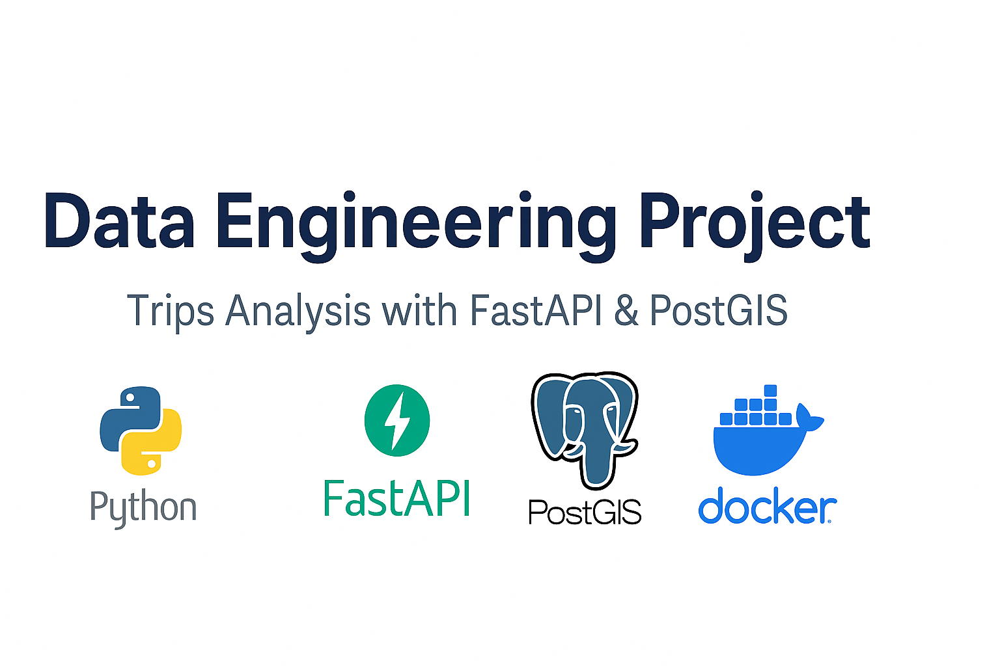

# 🚀 Data Engineering Project – Trips Analysis with FastAPI & PostGIS


## 🧭 Context




This project simulates a real-world data engineering challenge where a mobility analytics team needs to process and analyze **millions of trips** stored in CSV format. The goal is to build a robust pipeline that can:

- Efficiently ingest raw mobility data
- Enable **spatial-temporal analysis** (e.g., trips per week, by region, by origin/destination)
- Be deployed in production with **Docker** and **PostGIS**
- Offer real-time ingestion status via **WebSocket** (no polling)

It’s designed with scalability and modularity in mind, making it easy to extend with new features or scale to the cloud.

---

## 🔧 Technologies

- 🐍 Python + FastAPI
- 🐘 PostgreSQL with PostGIS extension
- 🐳 Docker + Docker Compose
- 📊 SQL for spatial analytics and grouping

---

## 📦 Features

- ✅ Automatic ingestion of CSV data
- ✅ Group trips by origin, destination and time of day
- ✅ Calculation of average weekly trips by region
- ✅ Ingestion status endpoint via WebSocket (no polling)
- ✅ Bonus SQL queries
- ✅ Ready to scale (PostGIS + indexing + dockerization)

---

## 🧪 How to Run Locally

> Requirements: [Docker](https://www.docker.com/)

```bash
git clone https://github.com/silvahudson/fastapi-trips.git
cd fastapi-trips
docker-compose up --build
````

Then access the API docs at:

```
http://localhost:8000/docs
```

---

## 📂 Main Endpoints

| Method | Endpoint        | Description                                      |
| ------ | --------------- | ------------------------------------------------ |
| POST   | `/ingest`       | Synchronous file ingestion `trips.csv`           |
| POST   | `/ingest_async` | Asynchronous ingestion with status via WebSocket |
| GET    | `/grouped`      | Grouping similar trips                           |
| GET    | `/weekly_avg`   | Weekly average by region (`?region=Turin`)       |
| WS     | `/ws/ingestion` | Ingestion status (idle/running/completed)        |

---

## 📊 Bonus Queries (SQL)

Located in `sql/03_bonus_queries.sql`, including:

* Latest datasource for the 2 most popular regions
* Regions where `cheap_mobile` appears

---

## ☁️ Cloud Architecture Sketch (AWS)

```
                          ┌──────────────────────┐
                          │      S3 (raw CSVs)   │
                          └─────────┬────────────┘
                                    │
                         ┌──────────▼─────────┐
                         │ Lambda (trigger)   │
                         │ ou API Gateway     │
                         └──────────┬─────────┘
                                    │
                         ┌──────────▼────────────┐
                         │     ECS/Fargate       │
                         │   (FastAPI Container) │
                         └──────────┬────────────┘
                                    │
                         ┌──────────▼────────────┐
                         │     RDS (PostGIS)     │
                         └───────────────────────┘
```

---

## 🧠 Observations

* Scalable design with spatial indexing (`GIST`), containerization and RDS/PostGIS compatibility.
* Modularized and ready for enhancements like message queues, Airflow, or Spark.

---

## 📁 Project Structure

```
fastapi-trips/
├── app/
│   ├── db.py
│   ├── ingestion.py
│   ├── main.py
│   ├── models.py
│   ├── grouping.py
│   ├── weekly.py
├── assets/
│   └── banner1.png
|   └── banner2.png
├── data/
│   └── trips.csv
├── sql/
│   ├── 01_enable_postgis.sql
│   ├── 02_create_table.sql
│   └── 03_bonus_queries.sql
├── Dockerfile
├── docker-compose.yml
├── requirements.txt
├── README.md
```

---

## 📄 License

This project is licensed under the MIT License.
